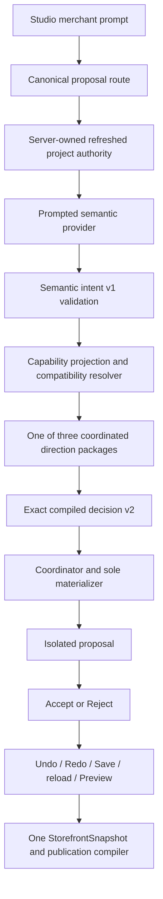
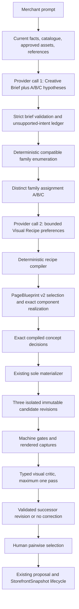

# P10B-19 Structural Design Intelligence Architecture

**Status:** Baseline - accepted architecture lock<br>
**Task:** P10B-19 PRE<br>
**Base:** merged P10B-18D at `b48fe304bf25b7274b79b841a9fafa0525644916`<br>
**Date:** 29 August 2026<br>
**Product-owner acceptance:** `ACCEPT P10B-19 PRE STRUCTURAL DESIGN INTELLIGENCE ARCHITECTURE`<br>
**Scope:** architecture and delivery design only; no production implementation

## 1. Executive summary

P10B-18D proved that Veskify's controlled generation path is technically reliable but
commercially compressed. Six bounded live calls all reached the intended provider and guarded
generation path, but only three concepts passed prompt fidelity. Most importantly, the materially
different bold-youthful and Finnish-bold-asymmetric prompts resolved to the exact same snapshot,
structural fingerprint, normalized topology, direction, frame, and principal page authority.

The root correction is not a larger prompt or more package labels. Veskify needs to separate three
authorities that the current coordinated direction packages correlate too tightly:

1. **Structural Storefront Family:** merchant-neutral, professionally designed cross-page
   composition authority.
2. **Visual Recipe:** merchant-specific visual identity preferences compiled into canonical
   `BrandSystem` and Design DNA v2 authority.
3. **Component Realization:** deterministic exact implementation through the one registered
   component, PageBlueprint, asset, commerce, proposal, and materialization path.

The target pipeline is:


This architecture keeps the current protected foundation unchanged: one canonical page graph, one
`StorefrontSnapshot`, one component registry, one deterministic compiler/coordinator, one final
materializer/executor, canonical commerce and media, isolated proposals, Accept/Reject, Undo/Redo,
Save, reload, Preview, publication compilation, and Puck as an adapter rather than persisted truth.

### Binding recommendations

| Decision                     | Recommendation                                                                                                                              |
| ---------------------------- | ------------------------------------------------------------------------------------------------------------------------------------------- |
| Initial structural inventory | Six deep families: editorial offset, campaign modular, product-first commerce, technical comparison, warm narrative, and restrained gallery |
| Creative interpretation      | One versioned, non-executable AI Creative Brief plus three bounded concept hypotheses                                                       |
| Exact structure              | Deterministic family and PageBlueprint v2 selection; the provider never selects IDs                                                         |
| Visual identity              | Provider-authored preferences, deterministically compiled into `BrandSystem` / Design DNA v2                                                |
| Multi-concept calls          | Two-call hybrid: brief/hypotheses, then recipes constrained by three deterministic family assignments                                       |
| Duplicate prevention         | Fail before materialization unless all three concepts have distinct family, topology, page hierarchy, and recipe identities                 |
| Screenshot refinement        | At most one critic pass per concept; every correction becomes a new immutable compiled revision                                             |
| Persistence                  | Persist compiled canonical authority and compact provenance references, not provider briefs, raw recipes, screenshots, or Puck data         |
| Migration                    | Additive v1/v2 coexistence; no forced regeneration of saved or published v1 storefronts                                                     |
| Delivery                     | Seventy-three bounded child tasks, one contract or one meaningful visual family/page-family increment per PR                                |

### The invisible professional template

An **invisible professional template** is a registered, merchant-neutral structural family whose
cross-page hierarchy, proportions, responsive behavior, and commerce flow are coherent enough to
look professionally designed before merchant styling, but whose own aesthetic identity disappears
after the merchant's facts, assets, and Visual Recipe are applied. It is not invisible because it
has no structure. It is invisible because it does not announce a reusable theme through repeated
copy, fixed imagery, signature decoration, merchant-specific colour, or a recognizable one-layout
package.

A family fails this definition when two unrelated merchants reveal the same theme identity, when a
family differs from another only through palette or copy, or when its name has no normalized
topology consequence.

## 2. P10B-18D diagnosis

### 2.1 Evidence boundary

The durable P10B-18D record intentionally excludes raw provider responses, credentials, and full
safe evidence payloads. It proves six call lineages and the accepted outcomes below. Field-level
provider intent is not durably available for every concept, so this architecture does not infer it.
Where an exact authority is not present in the durable record, the table says so rather than
reconstructing it from prompt text or screenshots.

The former `docs/P10B_16_REAL_PROVIDER_SYNTHESIS_ACCEPTANCE.md` named in the task input is not
present at this accepted base. The current durable acceptance source is
`docs/P10B_16P_04_REAL_STUDIO_DESIGN_INTENT_ACCEPTANCE.md`, supplemented by the P10B-18D section of
`docs/P10B_18_COMMERCIAL_QUALITY_AUDIT.md` and Git/PR history.

### 2.2 Six-concept architecture-gap table

| Concept and locked merchant intent                                                                                                                        | Retained semantic result                                                                                                             | Exact selected authority and normalized topology                                                                                                                                                                                                                                                                                                                                                 | Fidelity / commercial verdict       | Primary owner                                        | Secondary owner                                                                                                                                      | Evidence limit                                                                                                |
| --------------------------------------------------------------------------------------------------------------------------------------------------------- | ------------------------------------------------------------------------------------------------------------------------------------ | ------------------------------------------------------------------------------------------------------------------------------------------------------------------------------------------------------------------------------------------------------------------------------------------------------------------------------------------------------------------------------------------------ | ----------------------------------- | ---------------------------------------------------- | ---------------------------------------------------------------------------------------------------------------------------------------------------- | ------------------------------------------------------------------------------------------------------------- |
| 1. Dark gallery luxury: dark refined foundation, asymmetric gallery composition, generous negative space, rare-value positioning, avoid centered boutique | Strict semantic validation, compilation, and one materialization succeeded. Exact field-level intent is not retained durably.        | The durable record does not expose the complete selected-authority tuple. The rendered result did not establish a dark foundation or materially asymmetric gallery.                                                                                                                                                                                                                              | FAIL / rejected                     | Semantic vocabulary and Visual Recipe expressiveness | Compatibility concentration, structural inventory, and component relationships; provider interpretation remains unknown                              | Detailed safe record and explicit Reject proof are partial; 18 captures retained externally during acceptance |
| 2. Bold youthful campaign: bright energy, campaign blocks, products early, avoid traditional luxury structure                                             | Semantic and compiled-decision fingerprints differ from Concept 6, proving different request lineage but not field-level intent.     | `premiumEditorial`; `editorial-masthead`; home `homepage-campaign-led`; collection `collection-campaign-led-discovery`; search `collection-dense-search`; PDP `pdp-high-consideration`; exact snapshot `v1_49057_6341652a04f591a034f13fa060d0b4b4e8b831364792af884b755f8b83fa98eb`; exact structure `semantic-structure-v1_481_c0f23b1c1f1c1389236e47359b03bc100144106377d28be6a86cd30f49dc16b1` | FAIL as a distinct accepted concept | Resolver and compatibility funnel                    | Semantic expressiveness, finite PageBlueprint/frame/DNA inventory, and correlated direction packages                                                 | Complete safe evidence and Reject/raw restoration                                                             |
| 3. Technical configurable commerce: comparison, specifications, options, decision support, compact structure                                              | Complete strict semantic, compile, materialization, and protected-state evidence passed.                                             | Exact per-field selected authority remains in the accepted external safe record and is not reconstructed in this repository document. The accepted rendered behavior was technical/configurable and materially prompt-faithful.                                                                                                                                                                  | PASS / accepted diagnostic concept  | No primary architecture failure demonstrated         | Current inventory is strongest in this posture, which is also evidence of uneven capability coverage                                                 | Complete safe evidence and Reject/raw restoration                                                             |
| 4. Warm Nordic story: tactile calm, story/materials first, then collections/products                                                                      | Complete generation and lifecycle evidence passed through Reject/raw restoration.                                                    | Exact per-field selected authority remains external. The accepted result was materially warm, editorial, and story-led.                                                                                                                                                                                                                                                                          | PASS / accepted diagnostic concept  | No primary architecture failure demonstrated         | Process-local proposal retention limited later evidence recovery, not generation quality                                                             | Two cart captures became unavailable after the process-local candidate expired                                |
| 5. Restrained product-first: selective imagery, products/price/availability early, remove noise                                                           | Accepted safe evidence resolved 255 candidates to one with five accepted and three substituted semantic paths.                       | `warmApproachable`; `centered-minimal`; home `homepage-high-consideration`; collection/search `collection-dense-search`; PDP `pdp-high-consideration`; structure `semantic-structure-v1_496_fa2ab51ed587a9167476c71dc81882a99291a2e48b01e07ed9f04b4adab0587b`; snapshot `v1_48382_38f9dcd70f0cba6387867634f5ab26c9ac7fdc9f5ee3d536b4a232573fa396c5`                                              | PASS / accepted diagnostic concept  | No primary architecture failure demonstrated         | Three substitutions show that even a passing concept is partly funnelled into available packages                                                     | Complete generation and 14 captures; explicit Reject proof unavailable after runner continuity loss           |
| 6. Finnish bold asymmetric: bold modern asymmetry, strong typography and colour fields, products early, avoid centered empty luxury                       | Semantic and compiled-decision fingerprints differ from Concept 2, but retained evidence does not prove the exact field differences. | Exactly the same authority, snapshot, structure, and topology as Concept 2: `premiumEditorial`, `editorial-masthead`, `homepage-campaign-led`, `collection-campaign-led-discovery`, `collection-dense-search`, `pdp-high-consideration`                                                                                                                                                          | FAIL / rejected                     | Resolver and compatibility funnel                    | Missing semantic axes, structural inventory, Design DNA/frame concentration; media settlement and acceptance continuity are separate evidence owners | Blank mobile media observed; Accept/Undo/Redo/Save passed, reload and complete Preview did not                |

### 2.3 Why the current path compressed intent

Repository facts explain the earliest proven compression:

- The current semantic contract has eight commercial postures plus density, navigation,
  story/catalogue balance, collection discovery, configurable-PDP posture, mobile hierarchy, and
  image prominence. It has no merchant-wide foundation, composition asymmetry, visual energy,
  typography architecture, surface grammar, motion, or explicit anti-pattern authority.
- Commercial posture contributes `320` points in compatibility scoring. Other individual axes
  contribute `42` to `76`, so a correlated direction backbone dominates the exact outcome.
- The direction registry has only three coordinated packages: premium editorial, modern technical,
  and minimal commerce. Each package narrows frame, PageBlueprint profiles, card anatomy, Design
  DNA, merchandising, density, art direction, and responsive posture together.
- Current direction materialization changes bounded typography, shape, density, media, and surface
  choices, but preserves the baseline visual theme. A prompt cannot switch the merchant-wide
  foundation to dark through current semantic authority.
- PageBlueprint v1 already has useful roles, cardinality, ordering, responsive contracts, asset
  requirements, and bounded parameters, but its registered profiles are mostly complete packages.
  The resolver chooses among those packages rather than assembling materially different structural
  skeletons.
- Design DNA v1 is a strong typed token system, but new generation reaches a small set of correlated
  presets. Exact token breadth does not create diversity if the semantic and family layers cannot
  request and combine it.
- Several runtime component families expose only a small number of meaningful anatomy variants.
  Better prompts cannot create an offset region relationship, campaign module system, gallery-led
  PDP, or asymmetric responsive transformation that no registered anatomy can realize.

### 2.4 Lost, unconsumed, and unsolved distinctions

| Gap                                 | Classification                                           | Required owner                                                                          |
| ----------------------------------- | -------------------------------------------------------- | --------------------------------------------------------------------------------------- |
| Dark foundation                     | Lost before exact selection: no semantic field           | Creative Brief plus Visual Recipe v2 compiler                                           |
| Genuine asymmetry                   | Lost before exact selection and absent in many consumers | Creative Brief, Structural Family, PageBlueprint v2, and component anatomy              |
| Youthful energy vs Finnish boldness | Different lineage reached one package                    | Resolver diversity constraints plus Visual Recipe v2                                    |
| Strong typographic hierarchy        | Coarse current DNA choice; correlated to direction       | Visual Recipe v2 typography architecture                                                |
| Colour fields and visual blocks     | No structural region/surface relationship authority      | Structural Family, PageBlueprint v2, and surface grammar                                |
| Different complete-store hierarchy  | Finite package inventory                                 | Structural Family registry and page-family implementations                              |
| Mobile media blank state            | Not proven as generation or canonical-media mutation     | Image-settlement evidence first; renderer consumer only if reproduced                   |
| Reload/Preview continuity           | Not proven as persistence defect                         | Acceptance seam first; normal saved-snapshot hydration must remain independently tested |

Prompting alone cannot solve absent semantic fields, absent registered structures, insufficient
component anatomy, inaccessible palette compilation, or exact duplicate prevention.

## 3. Industry research

### 3.1 Evidence classification

The table distinguishes verified external behavior from Veskify recommendations. Marketing claims
are not treated as proof of output quality.

| System / primary source     | Verified exposed pattern                                                                                                                                                                                                                                                                                                                                                            | AI decision boundary                                           | Deterministic or design-system boundary                              | Adopt for Veskify                                                                                  | Do not adopt                                                                                      |
| --------------------------- | ----------------------------------------------------------------------------------------------------------------------------------------------------------------------------------------------------------------------------------------------------------------------------------------------------------------------------------------------------------------------------------- | -------------------------------------------------------------- | -------------------------------------------------------------------- | -------------------------------------------------------------------------------------------------- | ------------------------------------------------------------------------------------------------- |
| Google Stitch               | Prompt and image inputs, interactive refinement, multiple layout/style variants, Figma transfer, and frontend export are described by Google. [Google Developers Blog](https://developers.googleblog.com/en/stitch-a-new-way-to-design-uis/)                                                                                                                                        | AI interprets language/images and proposes visual interfaces   | Export is a workflow boundary, not a Veskify-like commerce authority | Reference descriptors, rapid concept alternatives, and explicit refinement                         | Generated frontend code as canonical or executable storefront authority                           |
| Figma Make / Make kits      | Kits combine production packages, library variables/styles, and written guidelines; Figma describes them as shared context for realistic prototypes. [Make kits](https://help.figma.com/hc/en-us/articles/39241689698839-Get-started-with-Make-kits), [design-system packages](https://help.figma.com/hc/en-us/articles/35946832653975-Use-your-design-system-package-in-Make-kits) | AI composes inside supplied code/style/guideline context       | The team's design system remains reusable context                    | Give the provider bounded capability projections and guidelines; reuse exact registered components | Letting provider packages or generated code define Veskify's registry                             |
| Framer Wireframer           | Wireframer explicitly focuses on purpose-built structure rather than style and produces responsive layouts ready for customization. [Framer Wireframer](https://www.framer.com/updates/wireframer)                                                                                                                                                                                  | AI proposes structural starting points                         | Canvas remains editable and styling is a later concern               | Separate structural family from merchant visual identity                                           | Treat a wireframe or canvas tree as canonical `StorefrontSnapshot`                                |
| Relume                      | The documented flow moves from brief to sitemap, wireframe, and design/style guide. [Relume sitemap](https://resources.relume.io/resources/docs/building-a-sitemap-with-ai), [Relume Publish flow](https://resources.relume.io/resources/publish/doc/getting-started-with-relume-publish)                                                                                           | AI assists staged planning and content                         | Component library and export targets constrain realization           | Explicit staged decomposition: brief -> structure -> visual system                                 | External sitemap, generated copy, or library blocks replacing canonical route/fact authority      |
| v0                          | v0 supports custom design-system registries and screenshot/file context; Design Mode can attach a selected-element screenshot to a structural instruction. [Design systems](https://v0.dev/docs/design-systems), [screenshots](https://v0.app/docs/screenshots), [Design Mode](https://v0.app/docs/design-mode)                                                                     | AI interprets prompts and visual references                    | Registry/components and visual editing constrain the result          | Registry-grounded generation and screenshot-informed bounded refinement                            | Source-code generation, arbitrary dependency choice, or screenshot replication as final authority |
| Webflow AI                  | Webflow says its site builder creates a multi-page site and a foundational design system that can be shaped later. [Webflow Help](https://help.webflow.com/hc/en-us/articles/38840145286035-Build-a-site-with-Webflow-s-AI-site-builder), [AI site builder](https://webflow.com/ai-site-builder)                                                                                    | AI proposes site structure, copy, imagery, and styles          | Webflow's site/design system becomes the editable environment        | Whole-store consistency and a merchant-wide visual system                                          | Generated copy/images overriding approved facts/assets or a second persisted model                |
| Puck                        | Puck's `Config` defines available components and rendering; `Data` is the editor payload consumed by `<Puck>` and `<Render>`. [Component configuration](https://puckeditor.com/docs/integrating-puck/component-configuration), [Data](https://puckeditor.com/docs/api-reference/data)                                                                                               | Optional editor/AI features operate over configured components | Host application owns config, validation, and persistence decisions  | Keep Puck as controlled canvas and projection boundary                                             | Persist raw Puck `Data` as storefront truth or expose unrestricted fields                         |
| Playwright                  | Playwright supports stable screenshot comparison and warns that rendering environment affects results. [Visual comparisons](https://playwright.dev/docs/test-snapshots)                                                                                                                                                                                                             | No design decision                                             | Deterministic environment and reviewed baselines                     | Stable captures, hashes, and machine regressions around critic input                               | Treat pixel similarity alone as commercial quality                                                |
| Google Spacewalker research | The research explores bounded UI configurations and pairwise human evaluation to search a design space. [Google Research](https://research.google/pubs/spacewalker-rapid-ui-design-exploration-using-lightweight-markup-enhancement-and-crowd-genetic-programming/)                                                                                                                 | Search proposes alternatives; humans compare                   | Annotated attributes bound the search space                          | Pairwise preference evidence and controlled alternatives                                           | Unbounded genetic mutation or crowd verdicts as commerce authority                                |
| ScreenAI research           | ScreenAI demonstrates that UI screenshots can be represented and reasoned about as structured visual information. [Google Research](https://research.google/pubs/screenai-a-vision-language-model-for-ui-and-infographics-understanding/)                                                                                                                                           | Vision model interprets rendered UI                            | It does not establish safe storefront mutation authority             | Typed visual diagnostics grounded to regions                                                       | Letting a critic directly edit code, DOM, commerce, or snapshot state                             |

### 3.2 Architecture inference

The verified common pattern is not “AI writes a website.” It is staged intent interpretation,
structure exploration, design-system grounding, editable realization, and visual iteration. The
Veskify-specific inference is to retain these stages as separately versioned authorities and keep
all executable choices deterministic and registry-bound. Veskify must be stricter because prices,
availability, product media, navigation, lifecycle, and publication have protected owners.

## 4. Current architecture map



### 4.1 Current canonical boundaries

| Authority                   | Current repository owner                                             | Current fact                                                                                                        |
| --------------------------- | -------------------------------------------------------------------- | ------------------------------------------------------------------------------------------------------------------- |
| Provider-safe intent        | `src/application/prompted-storefront-design-intent`                  | Strict, non-executable, current-authority-bound request and response                                                |
| Exact resolver              | `src/application/prompted-storefront-design-compiler`                | Scores finite compatible candidates and uses stable fingerprints                                                    |
| Coordinated directions      | `src/application/bounded-storefront-synthesis/direction-registry.ts` | Three correlated packages                                                                                           |
| Visual tokens               | `src/domain/design-system/design-dna.ts` and `brand-system.ts`       | Design DNA v1 projects exact validated CSS variables through canonical `BrandSystem`                                |
| Page composition            | `src/application/storefront-templates`                               | PageBlueprint v1 profile metadata, slots, role/cardinality, bounded parameters, and strict realization              |
| Exact components            | `src/domain/component-platform` and `src/components/registry`        | One registered component/anatomy authority                                                                          |
| Commerce                    | canonical projection and dynamic-commerce authority                  | Read-only products, options, variants, prices, availability, and media                                              |
| Approved presentation media | `approved-asset-placement.ts` and responsive-image authority         | Exact role, revision, material fingerprint, provenance, anatomy, crop, and responsive lineage                       |
| Proposal lifecycle          | `src/application/whole-storefront-proposal-lifecycle`                | Isolated atomic replay with stale/protected checks and undo/redo transaction                                        |
| Canonical aggregate         | `src/domain/storefront/storefront.ts`                                | One `StorefrontSnapshot` with pages, sections, frame, BrandSystem, navigation, dynamic commerce, and fact documents |
| Editor                      | `src/integrations/puck`                                              | Page projection to/from controlled Puck fields; protected payload checks; no raw Puck persistence                   |

### 4.2 Current strengths to preserve

- Strict schemas and current-authority fingerprints.
- Stable deterministic tie-breaking and replay.
- One exact decision and one final materializer.
- Registered component/variant/anatomy constraints.
- Protected commerce/media before/after checks.
- Exact approved asset lineage and responsive image authority.
- Proposal isolation, atomic acceptance, history, persistence, Preview, and publication separation.
- Existing v1 snapshot and dynamic-route migration readers.

## 5. Target architecture map



### 5.1 Layer invariants

| Layer                | May express                                                                    | Must not own                                             |
| -------------------- | ------------------------------------------------------------------------------ | -------------------------------------------------------- |
| Creative Brief       | Merchant meaning, priorities, mood, composition intent, avoidances, confidence | IDs, routes, facts, CSS, components, exact tokens        |
| Structural Family    | Merchant-neutral cross-page structure and compatible alternatives              | Merchant colours, fonts, imagery, copy, final finish     |
| PageBlueprint v2     | Per-page region skeleton and bounded realization constraints                   | Navigation graph, commerce facts, arbitrary DOM          |
| Visual Recipe intent | Merchant-specific visual preferences and anti-patterns                         | Exact inaccessible values, CSS, code, assets, components |
| Recipe compiler      | Exact typed Design DNA v2 and `BrandSystem` projection                         | New provider meaning or unapproved values                |
| Realizer             | Exact registered components, variants, parameters, assets, and bindings        | Unregistered implementation or protected mutation        |
| Critic               | Typed observations and bounded correction proposals                            | Code, CSS, DOM, commerce, publication, direct mutation   |

## 6. AI Creative Brief

### 6.1 Ownership and lifecycle

`AiCreativeBriefV1` is a provider-authored, non-executable interpretation of one current merchant
request. It is transient proposal input, versioned and fingerprinted, but not persisted as a second
storefront or visual model. The request binds it to current project, draft, catalogue, approved
brief/assets, locale, capability-index, and reference fingerprints.

The provider owns interpretation. Deterministic validation owns schema, current authority,
confidence bounds, fact/reference provenance, supported-value vocabulary, and conflict detection.

### 6.2 Required conceptual schema

| Field                                                 | Authority and bounds                                                                        |
| ----------------------------------------------------- | ------------------------------------------------------------------------------------------- |
| `version`, `requestFingerprint`, `briefFingerprint`   | Exact version/current request lineage; computed fingerprint is server-owned                 |
| `merchantPositioning`                                 | Bounded summary and approved positioning tags; no invented product claims                   |
| `targetAudience`                                      | Bounded audience needs/postures, not protected customer data                                |
| `commercialObjective`                                 | Prioritized enum list such as discover, compare, configure, trust, convert                  |
| `emotionalTone`                                       | Multi-axis bounded values, including calm/energetic, restrained/bold, familiar/experimental |
| `brandPersonality`                                    | Bounded descriptors with confidence                                                         |
| `narrativeCatalogueBalance`                           | Numeric or enumerated preference, separate from canonical catalogue size                    |
| `productComplexityInterpretation`                     | Provider emphasis only; actual complexity is derived from canonical commerce                |
| `discoveryPosture`, `conversionPosture`               | Bounded priorities                                                                          |
| `density`, `imageryProminence`, `proofDepth`          | Independent bounded axes                                                                    |
| `orderAsymmetry`, `visualEnergy`, `foundationPosture` | New explicit axes, including true light/dark/mixed intent                                   |
| `premiumAccessibilityConstraints`                     | Desired premium tone plus mandatory accessibility constraints, never a tradeoff             |
| `localisation`                                        | Active locale and cross-locale tone; facts remain localized authority                       |
| `referenceInfluences`                                 | Fingerprinted descriptor references and permitted influence scopes                          |
| `avoidances`                                          | Typed anti-patterns such as centered-everything, excessive whitespace, lifestyle-heavy      |
| `merchantPriorities`                                  | Ordered paths with bounded weights                                                          |
| `unsupportedIntents`                                  | Exact path, requested meaning, reason, available alternatives                               |
| `confidence`                                          | Per-field and overall bounded confidence; no hidden free-form reasoning                     |
| `conceptHypotheses`                                   | Primary, commercial alternative, exploratory alternative; preferences only, no IDs          |

### 6.3 Difference from semantic intent v1

Semantic intent v1 primarily classifies a prompt onto currently executable package axes. The
Creative Brief preserves merchant meaning before capability resolution, records unsupported intent
instead of silently substituting it, and exposes orthogonal visual and structural dimensions. It is
still bounded and non-executable.

### 6.4 Failure behavior

- Unknown schema fields, stale fingerprints, invalid locale/reference lineage, protected-fact
  claims, or executable payloads fail the request before selection.
- Unsupported intent is not silently mapped. The brief records the unsupported path and the
  concept planner either chooses a disclosed compatible interpretation or reports
  `insufficient-supported-intent`.
- Low confidence cannot be repaired by inventing exact structure. If critical paths are low
  confidence, generation pauses for merchant clarification in a future Studio task.
- One invalid concept hypothesis invalidates that hypothesis. Fewer than three valid hypotheses
  fail the three-concept request rather than returning palette-only duplicates.

## 7. Structural Storefront Family contract

### 7.1 Precise definition

A `StructuralStorefrontFamilyV1` is a versioned registry record over the existing canonical page
and PageBlueprint system. It owns cross-page structural coherence and a bounded set of per-page
alternatives. It is not a page graph, renderer, snapshot, template instance, or merchant style.

### 7.2 Required contract

| Contract member                                  | Meaning                                                                                         |
| ------------------------------------------------ | ----------------------------------------------------------------------------------------------- |
| `id`, `version`, `fingerprint`                   | Stable identity and canonical content fingerprint                                               |
| `purpose`                                        | Merchant-neutral design/commercial purpose                                                      |
| `supportedConditions` / `incompatibleConditions` | Catalogue cardinality, fact depth, media, product complexity, navigation, locale requirements   |
| `frameComposition`                               | Header/navigation/footer relationships, content offset, containment, continuity                 |
| `pageFamilyProfiles`                             | Compatible PageBlueprint v2 IDs for home, collection, search, PDP, content/support, and utility |
| `regionGraphConstraints`                         | Allowed region roles, relationships, order alternatives, proportions, and visual weights        |
| `requiredRegions` / `optionalRegions`            | Cross-page semantic requirements                                                                |
| `assetRoles` / `evidenceRequirements`            | Exact approved roles and truthful fact requirements                                             |
| `cardinalityAdaptation`                          | Registered sparse/standard/rich catalogue transformations                                       |
| `continuityRules`                                | Cross-page hierarchy, recurring visual anchors, navigation and merchandising continuity         |
| `responsiveTransformations`                      | Registered transformations at 375, 768, 1024, and 1440 authority                                |
| `componentFamilyCompatibility`                   | Allowed registered anatomy families, not exact final IDs                                        |
| `visualRecipeConstraints`                        | Allowed foundation, rhythm, proportion, media, surface, and control ranges                      |
| `omissionSubstitutionAuthority`                  | Typed evidence-dependent omission and compatible substitution                                   |
| `accessibilityConstraints`                       | Reading order, landmark, focus, contrast, target, and motion invariants                         |
| `migrationAuthority`                             | v1 aliases and supported upgrade paths                                                          |
| `normalizedTopologyIdentity`                     | Structural identity excluding merchant copy, palette, and asset URLs                            |

### 7.3 Initial family set

Six is the recommended initial set. Fewer would not cover the P10B-18D gaps; more would risk shallow
labels before the component inventory can prove meaning.

| Family                   | Material structural signature                                                                         | Best conditions                                                                                    | Incompatible or fail-closed conditions                                    | Cross-page distinction                                                                                           |
| ------------------------ | ----------------------------------------------------------------------------------------------------- | -------------------------------------------------------------------------------------------------- | ------------------------------------------------------------------------- | ---------------------------------------------------------------------------------------------------------------- |
| `editorial-offset`       | Offset frame, asymmetric media/text pairings, staggered narrative rhythm, deliberate negative space   | Strong brand story and approved editorial media                                                    | Sparse facts plus no presentation media                                   | Offset navigation/content anchors continue through collection lead, gallery-led PDP, and editorial content pages |
| `campaign-modular`       | Bold modular bands, early products, alternating visual blocks, strong typographic fields              | Campaign proposition, product selection, approved action; image-led regions require approved media | No truthful proposition/action for required campaign region               | Campaign modules recur as merchandising bands without turning utilities into campaigns                           |
| `product-first-commerce` | Compact orientation, product/price early, restrained narrative, high scan efficiency                  | Sparse or broad catalogues, conversion priority                                                    | Requests requiring deep narrative as primary hierarchy                    | Product-led home, minimal collection, balanced PDP, concise support and utility continuity                       |
| `technical-comparison`   | Utility frame, dense comparison, explicit filters/specification regions, configuration workspace      | Rich attributes/options, comparison and decision support                                           | Insufficient canonical attributes/options for required comparison regions | Comparison grammar across collection, search, configurable PDP, service and support                              |
| `warm-narrative`         | Story/material progression, soft alternating regions, gradual transition to commerce                  | Approved story/process/material facts and supporting media                                         | Generic prose without truthful stage/story evidence                       | Narrative frame carries into editorial discovery, high-consideration PDP, About/process, and service pages       |
| `restrained-gallery`     | Minimal chrome, large approved media, controlled gallery sequence, sparse but active commerce anchors | High-quality approved presentation/product media                                                   | Required gallery media unavailable or unsafe to crop                      | Gallery-led home and PDP with quieter collection/content framing and distinct non-gallery utility anatomy        |

Dark foundation is a Visual Recipe dimension compatible with more than one family. Asymmetry is a
structural dimension and therefore requires compatible families such as `editorial-offset` or
`campaign-modular`; a dark palette alone cannot claim asymmetry.

### 7.4 Meaningfulness gate

A family is registered only if all are true:

- Its normalized complete-store topology differs from every existing family.
- At least home plus two of collection/search/PDP have different region relationships, not only
  variants or labels.
- Mobile/tablet transformations preserve a distinct hierarchy.
- Its required evidence and fail-closed behavior are executable.
- Representative merchants do not expose family-owned decoration or copy.
- A visual reviewer can identify the structural difference with monochrome placeholder content.

P10B-19A may define stable candidate IDs and build empty registry/selector infrastructure, but
candidate families remain inactive and unreachable. Active registration occurs only after the
cross-page implementations and evidence above exist; the planned P10B-19G closure owns that final
meaningfulness gate. A candidate definition is not a registered family and cannot participate in
production selection.

## 8. PageBlueprint v2

### 8.1 Relationship to the canonical page graph

PageBlueprint v2 remains the one executable page-composition contract. Its “region graph” is a
bounded composition graph inside one page blueprint, not a second site/page/navigation graph.
`StorefrontSnapshot.pages`, routes, and navigation remain canonical.

### 8.2 v2 additions

| Area                | v1                                                    | v2 decision                                                                      |
| ------------------- | ----------------------------------------------------- | -------------------------------------------------------------------------------- |
| Structure           | Ordered slots and narrative roles                     | Typed region nodes plus registered relationships and order alternatives          |
| Cardinality         | Role and section ranges                               | Region, content, evidence, asset, and catalogue-sensitive ranges                 |
| Components          | Per-slot component/variant sets                       | Component-family/anatomy constraints first; exact component later                |
| Parameters          | Bounded inherited parameters                          | Structural parameters separated from recipe visual hooks                         |
| Responsive          | Breakpoint declarations and component transformations | Explicit region relationship/order/proportion transformations at all four widths |
| Family relationship | Complete profile selected inside direction package    | Profile belongs to compatible Structural Storefront Families                     |
| Identity            | Profile fingerprint                                   | Skeleton fingerprint plus exact realization fingerprint                          |
| Fallback            | Profile-specific omissions/substitutions              | Typed evidence-dependent rules with no false identity                            |

### 8.3 Conceptual schema

```text
PageBlueprintV2
  id / version / fingerprint / pageType
  compatibleStructuralFamilyIds
  skeleton
    regions[]
      stable role, required/optional, cardinality, visual weight
      allowed component families and anatomy capabilities
      binding categories, evidence requirements, asset roles
      structural parameter constraints and Visual Recipe hooks
    relationships[]
      precedes | pairs-with | offsets | contains | spans | anchors
    orderAlternatives[]
  catalogueCardinalityAdaptations[]
  responsiveTransformations[mobile|tablet|desktop|wide]
  omissionRules[] / substitutionRules[]
  accessibilityContract
  structuralFingerprint
```

Relationships are registered enums with validated acyclic reading order. They do not permit raw
CSS grid, arbitrary coordinates, DOM fragments, or unrestricted breakpoints.

### 8.4 Expected v2 coverage

| Page family     | Initial strong skeletons                                                                                                                                            |
| --------------- | ------------------------------------------------------------------------------------------------------------------------------------------------------------------- |
| Homepage        | Editorial offset, campaign modular, product-first, catalogue gateway, high-consideration narrative, restrained gallery                                              |
| Collection      | Editorial discovery, comparison matrix/list-grid, campaign merchandising, dense scan, minimal horizontal discovery                                                  |
| Search          | Query-first dense scan, filter-led comparison, minimal results, and explicit no-results recovery; search never impersonates a collection campaign without authority |
| PDP             | Gallery-led luxury, balanced commerce, configuration workspace, technical specification, editorial high consideration, minimal product-first                        |
| Content/support | Family-aware story/process, contact/directory, location, FAQ, service, policy, editorial reading, and campaign structures with existing truth gates                 |
| Utility         | Family-aware tokens/frame/rhythm, but state-specific cart, checkout, no-results, empty, error, 404, and loading anatomy remains primary                             |

Content/support and utilities inherit frame, recipe tokens, rhythm limits, control grammar, and
responsive emphasis. They do not inherit inappropriate campaign media, fake actions, or generic
page anatomy.

### 8.5 Exact realization

The deterministic realizer receives one selected v2 blueprint, one compiled Visual Recipe, current
component capability index, approved assets, facts, and commerce. It enumerates only registered
meaningful anatomy variants, validates bindings/evidence/asset roles, applies stable tie-breaking,
and emits the existing exact operation vocabulary. The provider never supplies component IDs.

## 9. Visual Recipe v2

### 9.1 Persistence decision

Visual Recipe v2 has three layers:

1. `VisualRecipeIntentV1`: provider-authored preferences, transient and non-executable.
2. `CompiledVisualRecipeV1`: deterministic exact decision, transient proposal authority with a
   fingerprint.
3. `DesignDnaV2` inside canonical `BrandSystem`: persisted merchant-wide visual authority.

The provider-facing recipe is not persisted as a second visual model. A compact accepted
`designAuthority` reference in `StorefrontSnapshot` records the structural-family, Creative Brief,
compiled-recipe, and compiler fingerprints. The exact visual values live only in `BrandSystem` /
Design DNA v2.

### 9.2 Recipe dimensions

| Dimension               | Typed authority                                                                                                          |
| ----------------------- | ------------------------------------------------------------------------------------------------------------------------ |
| Atmosphere/foundation   | `light`, `dark`, or `mixed`; semantic contrast surfaces and region usage                                                 |
| Typography architecture | Approved font registry categories, role pairing, hierarchy contrast, scale, weight, line height, tracking, casing limits |
| Semantic palette        | Exact accessible roles compiled from approved merchant colours and audited neutral/preset transforms                     |
| Spacing and rhythm      | Merchant-wide scale plus bounded section rhythm sequences                                                                |
| Container proportions   | Reading/content/commerce widths and role-specific proportions within family limits                                       |
| Surface grammar         | Quiet, tonal, layered, outlined, contrast, or mixed registered relationships                                             |
| Border/radius/elevation | Consistent grammar, not per-component arbitrary styling                                                                  |
| Controls                | Primary/secondary treatment, shape, emphasis, hierarchy, and target size                                                 |
| Product cards           | Image/text proportion, metadata hierarchy, finish, and action posture                                                    |
| Media                   | Ratio, crop, overlay, prominence, focal/safe-area posture, photography guidance                                          |
| Motion                  | `none`, `restrained`, `editorial`, or `energetic` registered motion tokens; reduced-motion equivalent required           |
| Responsive emphasis     | What leads, compresses, reorders, or becomes quieter at each registered width                                            |
| Anti-patterns           | Typed prohibitions such as centered-all, excessive-empty, card-everything, decorative-shadow, or lifestyle-heavy         |
| Cross-page invariants   | Repeated typography, surface, control, media, and rhythm relationships                                                   |

### 9.3 Solving current limitations safely

- **True dark foundations:** `foundation=dark` changes exact semantic page/surface/text/action roles
  through the compiler. Contrast, focus, status, product media, and approved logo variants must all
  pass. If no compliant approved palette/logo treatment exists, the intent is unsupported rather
  than simulated by one dark section.
- **Bold energy:** independent type-scale contrast, surface-field rhythm, control emphasis, media
  prominence, and motion tokens can combine within a compatible family.
- **Genuine asymmetry:** owned by family/blueprint region relationships; recipe controls visual
  emphasis inside those bounds.
- **Wider typography:** exact fonts come only from a licensed approved registry; the provider asks
  for architecture categories, never font URLs.
- **Distinctive cards/controls:** one merchant-wide grammar constrains registered anatomy; no
  per-instance CSS.
- **Responsive identity:** recipe hooks choose bounded emphasis while PageBlueprint owns structural
  transformation.

### 9.4 Compatibility and failure

The recipe compiler intersects provider preferences, family constraints, accessibility, approved
font/palette/media authority, and component capabilities. It reports accepted, substituted,
unsupported, and conflicting paths. Critical requested identity such as dark foundation or strong
asymmetry cannot be silently substituted while retaining the same concept claim.

## 10. Multi-concept generation

### 10.1 Recommended two-call hybrid

1. Provider call 1 returns one Creative Brief and three concept hypotheses: requested primary,
   commercially valid structural alternative, and exploratory compatible alternative.
2. Deterministic authority enumerates compatible family/blueprint candidates and assigns three
   pairwise-distinct Structural Families using stable case-ID/fingerprint tie-breaking.
3. Provider call 2 receives the validated brief plus safe capability summaries of the three
   assigned families and returns three bounded Visual Recipe intents. It cannot change assignments
   or name exact IDs.
4. Deterministic compilation produces three exact, immutable concept decisions and materializes
   each once.

This uses at most two initial provider calls for three concepts. There is no automatic retry or
fallback. A failed call or invalid response fails the concept set with typed evidence.

### 10.2 Required concept distinction

| Concept | Role                               | Mandatory distinction                                                                                            |
| ------- | ---------------------------------- | ---------------------------------------------------------------------------------------------------------------- |
| A       | Primary requested interpretation   | Highest prompt fidelity among compatible candidates                                                              |
| B       | Commercial alternative             | Different family and complete-store topology while retaining objective and facts                                 |
| C       | Exploratory compatible alternative | Different family, hierarchy, responsive posture, and recipe; may stretch mood/composition but not commerce truth |

Before materialization, every pair must have:

- different Structural Family IDs;
- different normalized complete-store topology fingerprints;
- different homepage hierarchy/order-alternative IDs;
- at least two additional differing page-structure identities among collection, search, PDP, and
  content;
- different compiled recipe fingerprints and different values on at least two primary recipe axes;
- no protected commerce/media difference.

If three candidates cannot meet these rules, return `insufficient-distinct-concept-capacity` with
the exact excluded conditions. Never fill a slot with a palette-only duplicate.

### 10.3 Alternatives

| Option                                            | Benefits                                                                                    | Risks / migration cost                                                     | Decision                                                    |
| ------------------------------------------------- | ------------------------------------------------------------------------------------------- | -------------------------------------------------------------------------- | ----------------------------------------------------------- |
| A. One response containing all briefs and recipes | Lowest latency/cost; one failure boundary                                                   | Structure is not known when recipes are authored; correlated concepts      | Rejected as the long-term lock                              |
| B. One brief, three deterministic plans/recipes   | Most reproducible and cheap                                                                 | Visual identity may remain preset-like; provider cannot react to structure | Useful deterministic mock mode, not final live architecture |
| C. Three independent provider calls               | Better isolation and potentially broader ideation                                           | Highest cost/latency; call variance; harder shared-brief consistency       | Rejected initially                                          |
| D. Two-call hybrid                                | Separates interpretation, exact structural assignment, and visual preferences; bounded cost | More orchestration and a second strict schema                              | Recommended                                                 |

## 11. Reference influence

### 11.1 Authority model

An `ApprovedDesignReferenceV1` records source type (`merchant-provided` or `internal-curated`),
provenance, rights/permitted-use declaration, content fingerprint, locale/context, and allowed
influence scopes. The raw reference remains untrusted evidence. It never becomes a storefront asset
unless separately approved through existing asset authority.

An analysis stage may later produce `ReferenceDescriptorSetV1` with bounded descriptors for:

- structural influence: alignment, region rhythm, hierarchy, proportion, density, asymmetry;
- visual influence: foundation, typography posture, surface grammar, colour relationship, media
  treatment, and motion posture;
- explicit exclusions and confidence.

The descriptor set is versioned/fingerprinted, supplied to the Creative Brief and recipe stages,
and validated against family/recipe capability. It cannot contain copied markup, CSS, component
IDs, trademarks as design tokens, extracted product claims, or instructions from the image.

### 11.2 Options

| Option                                                  | Benefit                                                                 | Risk                                                      | Decision                                 |
| ------------------------------------------------------- | ----------------------------------------------------------------------- | --------------------------------------------------------- | ---------------------------------------- |
| Raw reference directly drives generated code/layout     | High apparent fidelity                                                  | Copying, prompt injection, arbitrary code, no determinism | Rejected                                 |
| Typed descriptor extraction with provenance and scope   | Bounded influence, auditable, compatible with deterministic realization | Requires a future analysis contract and evaluation        | Recommended                              |
| Curated template/reference IDs map directly to families | Simple and deterministic                                                | Theme copying and family recognizability                  | Rejected except as weak ranking evidence |

## 12. Screenshot critic

### 12.1 Role and input

The future critic is a vision-capable diagnostic provider behind a separate bounded adapter. It
receives only:

- sanitized screenshots and surface/viewport identities;
- Creative Brief and compiled recipe summaries;
- structural/recipe/component fingerprints;
- registered region IDs and bounding geometry;
- machine accessibility, geometry, image-settlement, and runtime results;
- explicit protected-state fingerprints.

It never receives credentials, raw environment values, arbitrary HTML, provider reasoning, or
canonical commerce mutation authority.

### 12.2 Capture set

Machine responsive gates continue at 375, 768, 1024, and 1440. Critic input is bounded to:

- seven primary surfaces at 375 and 1440: home, collection, search, simple PDP, configurable PDP,
  representative content/support, and cart/utility;
- home and configurable PDP at 768 and 1024;
- maximum 18 screenshots per concept per critic pass.

### 12.3 Output contract

`ScreenshotCriticReportV1` contains report/decision fingerprints and typed diagnostics:

```text
diagnostic
  surface / viewport / regionId
  category
    hierarchy | spacing | dead-area | collision | typography | image-scale
    crop | card-balance | action-visibility | mobile-composition
    cross-page-coherence | prompt-fidelity | structural-repetition
  severity: blocker | major | minor | observation
  confidence: bounded number
  evidence: bounded region coordinates and concise explanation
  proposedCorrectionOperations[]
```

Allowed operations are restricted to selecting an already registered order alternative, changing
a bounded region prominence/span/alignment/rhythm value, selecting a compatible meaningful variant,
adjusting a compiled recipe token within family/accessibility limits, selecting an approved crop or
treatment, or applying an existing evidence-authorized omission/substitution.

The critic cannot return code, CSS, DOM, routes, facts, component IDs outside the candidate set,
new assets, or publication instructions.

### 12.4 Pass and stopping policy

The initial maximum is **one correction pass per concept**. A correction compiles into a new
immutable successor decision and is materialized exactly once; the critic never mutates the first
candidate. Stop without correction when confidence is below threshold, no major issue has an
allowed operation, protected/runtime gates fail, or the proposal would reduce cross-page
coherence. Stop after the successor regardless of remaining aesthetic observations and hand the
result to human review.

After correction, rerun protected commerce/media, schema, topology, accessibility, runtime,
geometry, and image-settlement gates. Recapture all primary surfaces, not only the changed page, so
one-page improvement cannot hide a cross-page regression.

### 12.5 Alternatives

| Option                     | Benefits                                                         | Risks                                                  | Decision                                                      |
| -------------------------- | ---------------------------------------------------------------- | ------------------------------------------------------ | ------------------------------------------------------------- |
| No visual critic           | Cheapest and deterministic                                       | Repeats one-shot visual failures                       | Rejected for final architecture                               |
| One bounded pass           | Captures high-value rendered defects with bounded cost and drift | Some issues remain for humans                          | Recommended initial policy                                    |
| Multiple autonomous passes | Potentially better local polish                                  | Cost, oscillation, overfitting, cross-page regressions | Rejected until evidence justifies a new architecture decision |

## 13. Human preference evidence

### 13.1 Durable record

`StorefrontConceptPreferenceRecordV1` is append-only evidence outside `StorefrontSnapshot`. It
contains safe references and fingerprints, not raw provider responses or screenshot binaries:

- merchant request and Creative Brief fingerprints plus safe summaries;
- Structural Family and PageBlueprint identities;
- compiled Visual Recipe and exact decision fingerprints;
- screenshot object references, hashes, surface, locale, and viewport;
- three-concept comparison identity;
- product-owner/merchant verdict and pairwise preference;
- rejection categories and bounded notes;
- critic diagnostics and accepted/rejected correction identity;
- final proposal/snapshot fingerprint and lifecycle outcome.

Rejection categories are: `generic`, `insufficiently-different`, `wrong-mood`, `weak-hierarchy`,
`excessive-whitespace`, `poor-conversion-flow`, `media-mismatch`, `responsive-weakness`,
`prompt-mismatch`, `cross-page-inconsistency`, `accessibility`, and `technical-failure`.

### 13.2 Learning order

1. Retrieval of similar accepted/rejected records for safe provider context.
2. Deterministic family/recipe ranking priors.
3. Few-shot examples selected by facts, family, locale, and evidence quality.
4. A separately evaluated preference/ranking model after sufficient audited pairwise evidence.
5. Foundation-model fine-tuning only after a future data-governance and quality decision proves
   broad, representative, rights-cleared evidence. It is not part of P10B-19.

### 13.3 Storage alternatives

| Option                                                             | Benefit                                             | Risk                                                              | Decision                                                |
| ------------------------------------------------------------------ | --------------------------------------------------- | ----------------------------------------------------------------- | ------------------------------------------------------- |
| Store preference record inside snapshot                            | Easy linkage                                        | Pollutes canonical storefront and history; duplicates screenshots | Rejected                                                |
| Append-only project evidence repository with snapshot fingerprints | Auditable, lifecycle-linked, independently retained | Requires retention/security policy                                | Recommended                                             |
| External analytics only                                            | Easy aggregation                                    | Weak transactional linkage and deletion control                   | Rejected as sole authority; optional derived sink later |

## 14. Deterministic ownership

### 14.1 Authority table

| Decision                        | Current owner                    | Future owner                                       | Canonical / transient                    | Persisted / derived                             | Versioned identity                          | Failure behavior                                 |
| ------------------------------- | -------------------------------- | -------------------------------------------------- | ---------------------------------------- | ----------------------------------------------- | ------------------------------------------- | ------------------------------------------------ |
| Merchant request                | Studio/project                   | Unchanged                                          | Canonical input                          | Persisted by existing request/lifecycle policy  | Request fingerprint                         | Invalid input rejected                           |
| Current facts/catalogue/assets  | Existing authorities             | Unchanged                                          | Canonical                                | Persisted/current source                        | Existing fingerprints                       | Stale or conflicting request fails               |
| Merchant interpretation         | Semantic intent provider         | AI Creative Brief provider                         | Transient                                | Safe evidence only                              | Brief schema/fingerprint                    | Strict failure; unsupported paths disclosed      |
| Product complexity facts        | Capability projection            | Canonical capability projection                    | Canonical projection                     | Derived                                         | Capability fingerprint                      | Provider cannot override                         |
| Concept roles                   | Implicit one outcome             | Brief hypothesis roles A/B/C                       | Transient                                | Evidence only                                   | Hypothesis fingerprint                      | Fewer than three valid roles fails set           |
| Structural family candidate set | Direction compatibility          | Structural Family compatibility engine             | Transient exact authority                | Derived                                         | Candidate-set fingerprint                   | Empty/insufficient set fails                     |
| Exact family selection          | Resolver                         | Deterministic three-concept planner                | Transient exact decision                 | Evidence plus accepted compact ref              | Family/version/fingerprint                  | Stable fail closed                               |
| Visual preferences              | Direction/semantic package       | Visual Recipe intent provider                      | Transient                                | Evidence only                                   | Intent fingerprint                          | Invalid/unsupported path fails or is disclosed   |
| Exact visual values             | Direction materializer           | Recipe compiler into `BrandSystem` / DNA v2        | Canonical after acceptance               | Persisted in snapshot BrandSystem               | DNA/recipe/compiler fingerprints            | Contrast/capability failure                      |
| Page skeleton                   | PageBlueprint v1 profile         | PageBlueprint v2 selected under family             | Canonical executable composition         | Profile ref and materialized sections persisted | Blueprint/version/fingerprint               | Unknown/stale/incompatible fails                 |
| Exact component/variant         | Current resolver/materializer    | Deterministic realizer                             | Transient decision -> canonical sections | Persisted as existing sections                  | Registry/anatomy/realization fingerprints   | No compatible realization fails                  |
| Routes/navigation               | Existing page/site-map authority | Unchanged                                          | Canonical                                | Persisted                                       | Existing authority fingerprints             | Provider cannot write                            |
| Asset selection                 | Approved placement resolver      | Unchanged, informed by family/recipe role requests | Canonical placement                      | Persisted                                       | Exact asset/revision/provenance fingerprint | Required unresolved asset fails/omits truthfully |
| Commerce binding                | Canonical commerce projection    | Unchanged                                          | Canonical read-only                      | Referenced/derived                              | Commerce fingerprint                        | Mutation fails                                   |
| Materialization                 | Sole current materializer        | Same sole materializer                             | Canonical candidate output               | Proposal then snapshot on acceptance            | Decision/materialization fingerprint        | Atomic failure, no partial candidate             |
| Screenshot diagnosis            | Human/machine evidence           | Typed critic adapter                               | Transient diagnostic                     | Preference evidence only                        | Critic report fingerprint                   | Never mutates directly                           |
| Correction                      | Existing follow-up operations    | Deterministic correction compiler                  | Transient successor decision             | Proposal/evidence                               | Correction/decision fingerprint             | Invalid or regressive correction rejected        |
| Human selection                 | Proposal review                  | Three-concept comparison then existing review      | Canonical decision event                 | Lifecycle/evidence                              | Preference/proposal fingerprint             | Rejection leaves draft unchanged                 |
| Save/history/Preview/publish    | Existing lifecycle               | Unchanged                                          | Canonical                                | Persisted                                       | Existing snapshot/publication fingerprints  | Existing fail-closed behavior                    |

### 14.2 One materialization rule

Each exact compiled concept decision is immutable and materialized once. A critic correction is a
new successor decision with lineage, not a second execution of or mutation to the same decision.
Only the human-selected proposal can enter the existing acceptance lifecycle.

## 15. Security and commerce boundaries

- Provider inputs are safe projections of current authority, never raw repositories, secrets, or
  arbitrary source HTML.
- Creative Brief and recipe schemas reject routes, IDs, CSS, code, markup, commerce values, and
  asset URLs.
- Reference images/evidence are untrusted; metadata and embedded instructions have no authority.
- Exact components, variants, parameters, routes, assets, and bindings are selected and validated
  server-side.
- Product, variant, option, price, SKU, availability, collection membership, and canonical product
  media remain read-only and fingerprint-protected.
- Presentation assets require current approved role, purpose, revision, material fingerprint,
  provenance, anatomy slot, and responsive lineage.
- Dark palettes, motion, typography, crops, and overlays must pass accessibility, safe-area,
  licensing, and component capability checks.
- Critic diagnostics are data, never executable operations. Correction operations pass the same
  proposal/protected-field guards as other changes.
- No provider owns persistence, acceptance, history, publication, retries, or fallback.
- Puck receives controlled projections and cannot expose protected payload or arbitrary CSS.

## 16. Migration strategy

### 16.1 Additive versioning

| Current authority                   | Migration disposition                                                                                                                                |
| ----------------------------------- | ---------------------------------------------------------------------------------------------------------------------------------------------------- |
| `StorefrontSnapshot`                | Remains the single aggregate. Add an optional compact `designAuthority` reference only for accepted v2 snapshots. No second graph or recipe payload. |
| `BrandSystem`                       | Remains canonical. Its `designDna` becomes a discriminated v1/v2 union. New generation writes v2; old snapshots retain exact v1.                     |
| PageBlueprint v1 profiles           | Remain registered for old snapshot rendering, replay, publication, and compatibility tests.                                                          |
| PageBlueprint v2                    | Added to the same template/profile registry and materialization boundary, with explicit version dispatch.                                            |
| Coordinated direction packages      | Become `legacy-v1` generation/replay aliases. They are not selected by new v2 generation after cutover.                                              |
| Component variants/anatomy          | Remain canonical. New structural variants are added granularly only when a family task proves meaning.                                               |
| Provider semantic intent v1         | Retained for historical evidence/tests and temporary gated rollback; superseded by Creative Brief/Recipe contracts for v2 generation.                |
| Approved assets/responsive images   | Unchanged canonical authority.                                                                                                                       |
| Proposal lifecycle and materializer | Unchanged boundary; extended to accept versioned exact decisions.                                                                                    |
| Puck projection                     | Continues from materialized snapshot pages/sections; adds fields only when registered and protected.                                                 |

### 16.2 Persisted versus transient v2 data

Persisted in the same `StorefrontSnapshot`:

- materialized pages, sections, frame, navigation, facts, dynamic-commerce authority, and approved
  placements as today;
- `BrandSystem` with Design DNA v2 exact values;
- per-page existing family/profile version/fingerprint references pointing to v2 profiles;
- optional compact `designAuthority` with Structural Family, Creative Brief, compiled recipe,
  compiler, and accepted concept fingerprints.

Transient or separate evidence:

- provider request/response envelopes;
- Creative Brief and Visual Recipe intent payloads;
- candidate sets, scoring diagnostics, and critic reports;
- unselected concepts;
- screenshots and human preference records.

### 16.3 Read, write, rollback

- Existing snapshots parse and render without modification. No automatic write-back or forced
  regeneration occurs.
- A v1 draft can receive a v2 whole-store proposal; acceptance writes a new snapshot revision while
  retaining the original history entry.
- Publication compiles whichever registered profile/DNA version the accepted snapshot references.
- The migration adapter maps a current direction package to a legacy family/recipe reference only
  for replay and diagnostics. It must preserve byte-equivalent rendered authority where current
  tests require it.
- Rollback can disable **new v2 request entry** and return to the still-registered v1 generator
  during staged rollout. Once a v2 request starts, failure does not silently fall back to v1.
- After full v2 acceptance, v1 generation is disabled while v1 read/render/publish compatibility
  remains.

### 16.4 No big-bang rewrite

Contracts and adapters land first. Each structural family and page family then becomes reachable
only after its anatomy, responsive behavior, deterministic realization, and visual checkpoint pass.
The existing generation path remains the default until a later integration child task explicitly
switches a bounded capability.

## 17. Puck boundary

Puck continues to provide registered-component editor mechanics, field/section interaction,
canvas rendering, selection, insertion where allowed, drag/reorder within blueprint constraints,
and manual bounded operations.

The projection is:


Structural Family and Visual Recipe do not become Puck registries. The accepted snapshot already
contains exact sections, profile references, and BrandSystem values. Puck renders those through the
one config. Manual operations are checked against the active v2 blueprint and family constraints;
protected commerce/media and hidden payload checks remain.

Puck must not persist raw `Data`, accept AI code/CSS, own commerce, choose families, or become a
second page graph. P10B-19 does not redesign the Puck UI.

## 18. P10B-19A-J parent plan

| Parent   | Outcome                                                     | Entry dependency               | Exit boundary                                                                                                                                                    |
| -------- | ----------------------------------------------------------- | ------------------------------ | ---------------------------------------------------------------------------------------------------------------------------------------------------------------- |
| P10B-19A | Structural Storefront Family and PageBlueprint v2 contracts | Accepted PRE                   | Versioned schemas, inactive candidate catalogue, registry/selector infrastructure, topology identity, and v1 compatibility; no active v2 family or visual output |
| P10B-19B | Visual Recipe / Design DNA v2                               | 19A constraints                | Provider-safe recipe, deterministic compiler, accessible dark/visual grammars, BrandSystem v2 compatibility                                                      |
| P10B-19C | Shared frame/navigation/footer families                     | 19A-B                          | Six meaningful cross-page frame signatures with responsive checkpoints                                                                                           |
| P10B-19D | Homepage/hero/editorial/merchandising families              | 19C                            | Six strong homepage skeletons reachable through family authority                                                                                                 |
| P10B-19E | Collection/search/product-card families                     | 19C-D                          | Distinct discovery/comparison/campaign/dense/minimal structures and truthful search                                                                              |
| P10B-19F | PDP gallery/configuration/purchase families                 | 19B-C and card/media authority | Six materially different PDP structures with protected purchase/media truth                                                                                      |
| P10B-19G | Content/support/utility families                            | 19C and page families          | Family-aware but truth-preserving content/support and state-specific utilities                                                                                   |
| P10B-19H | AI design director and multi-concept generation             | 19A-G                          | Creative Brief, two-call hybrid, deterministic three-concept planner, duplicate prevention; mocked lifecycle                                                     |
| P10B-19I | Screenshot critic and bounded refinement                    | 19H                            | Typed captures/critic/corrections and append-only preference evidence; one pass                                                                                  |
| P10B-19J | Final live AI and human commercial acceptance               | 19I                            | Bounded live three-concept evidence, full lifecycle, human gate, and phase status decision                                                                       |

## 19. Granular child-task plan

### 19.1 Merge-size and checkpoint policy

- One child task, branch, PR, and merge boundary.
- A contract task owns one schema/registry/compiler boundary and no visual family.
- A visual task owns one family on one page family, plus its responsive behavior.
- Target maximum is 12 production files and 1,500 net production lines; split before exceeding it
  unless generated fixtures explain the count.
- A visual child retains at most 16 focused screenshots, normally four widths plus EN/FI and one
  before/after or sibling comparison.
- Every meaningful visual family requires a product-owner screenshot checkpoint before merge.
- Mocked/deterministic AI is the default through 19I. Real provider calls are reserved for 19J
  after explicit call authorization.
- Integration children add no new visual family; they prove cross-page compatibility and lifecycle.

### 19.2 P10B-19A - six children

| ID     | Scope and authority owner                                                                                                                                      | Dependency        | Expected difference / evidence                                                                                                           | AI and checkpoint                          | Non-goals / merge boundary                                            |
| ------ | -------------------------------------------------------------------------------------------------------------------------------------------------------------- | ----------------- | ---------------------------------------------------------------------------------------------------------------------------------------- | ------------------------------------------ | --------------------------------------------------------------------- |
| 19A-01 | Vocabulary and invariants in proposed `src/domain/structural-storefront-family`; architecture contracts only                                                   | PRE               | No visual delta; schema and forbidden-authority tests                                                                                    | Zero AI; no visual checkpoint              | No registry entries; merge vocabulary/schema                          |
| 19A-02 | Versioned Structural Family registry infrastructure, lifecycle status, and candidate fingerprints in proposed `src/application/structural-storefront-families` | A-01              | Six candidate definitions have stable IDs/fingerprints but remain inactive and unreachable                                               | Mocks only; no screenshots                 | No active family entries or renderers; merge infrastructure           |
| 19A-03 | PageBlueprint v2 schema/version dispatch in existing `src/application/storefront-templates`                                                                    | A-01              | Region graph, alternatives, constraints, responsive rules validate                                                                       | Mocks only                                 | No v2 family content; merge contract                                  |
| 19A-04 | Deterministic compatibility/selection infrastructure and normalized topology v2                                                                                | A-02/A-03         | Contract fixtures prove distinct family/topology selection with stable tie-breaks; inactive candidates cannot enter production selection | Mocks only                                 | No provider changes or active families; merge selector infrastructure |
| 19A-05 | v1 profile/direction compatibility readers and publication replay                                                                                              | A-03/A-04         | Existing snapshots render/publish identically                                                                                            | Zero AI; focused historical regression     | No forced migration; merge adapters                                   |
| 19A-06 | 126/72 retained matrix extension and architecture closure                                                                                                      | A-02 through A-05 | Accepted metrics preserved; v2 contracts cannot weaken v1                                                                                | Deterministic only; PO contract checkpoint | No visible family claim; merge 19A closure                            |

### 19.3 P10B-19B - seven children

| ID     | Scope and authority owner                                                  | Dependency        | Expected difference / evidence                                                              | AI and checkpoint                     | Non-goals / merge boundary                       |
| ------ | -------------------------------------------------------------------------- | ----------------- | ------------------------------------------------------------------------------------------- | ------------------------------------- | ------------------------------------------------ |
| 19B-01 | `VisualRecipeIntentV1` safe schema/capability projection                   | 19A               | No visual delta; executable fields rejected                                                 | Mock provider only                    | No BrandSystem write; merge contract             |
| 19B-02 | Design DNA v2 and BrandSystem v1/v2 union in existing design-system domain | B-01              | Exact typed axes can represent dark, energy, asymmetry hooks, richer rhythm                 | Zero AI; token fixtures               | No renderer restyle; merge canonical schema      |
| 19B-03 | Deterministic recipe compiler and family constraint intersection           | A-02/B-02         | Same input produces exact recipe; unsupported identity fails visibly                        | Mock intent; no visual checkpoint     | No new components; merge compiler                |
| 19B-04 | Accessible dark/mixed foundation projection                                | B-03              | True merchant-wide dark surfaces, controls, focus, statuses, and logos on one proof surface | Mocks; required 4-width PO checkpoint | No family structure; merge foundation capability |
| 19B-05 | Typography, surface, control, and card grammar projection                  | B-03              | At least three materially different non-colour merchant identities on unchanged structure   | Mocks; required PO checkpoint         | No new page skeleton; merge grammar              |
| 19B-06 | Responsive emphasis, media, and reduced-motion recipe hooks                | B-03              | Distinct bounded emphasis at four widths without layout breakage                            | Mocks; required PO checkpoint         | No arbitrary breakpoints/animation; merge hooks  |
| 19B-07 | v1 DNA migration/replay and BrandSystem closure                            | B-04 through B-06 | v1 exact render preserved; v2 save/reload/Preview deterministic                             | Zero AI; PO compatibility checkpoint  | No provider integration; merge 19B closure       |

### 19.4 P10B-19C - eight children

| ID     | Scope and authority owner                                           | Dependency        | Expected difference / evidence                                                      | AI and checkpoint                  | Non-goals / merge boundary                    |
| ------ | ------------------------------------------------------------------- | ----------------- | ----------------------------------------------------------------------------------- | ---------------------------------- | --------------------------------------------- |
| 19C-01 | Shared-frame anatomy/continuity contract in existing frame registry | 19A-B             | No style-only aliases; frame topology and responsive transformations measurable     | Mocks; no visual claim             | No renderer family; merge contract            |
| 19C-02 | Editorial-offset frame                                              | C-01              | Offset navigation/content anchors and asymmetric desktop/tablet composition         | Mocks; 4-width PO checkpoint       | No homepage body; merge one frame             |
| 19C-03 | Campaign-modular frame                                              | C-01              | Strong header/campaign rhythm and early commerce orientation                        | Mocks; 4-width PO checkpoint       | No campaign homepage modules; merge one frame |
| 19C-04 | Product-first frame                                                 | C-01              | Compact navigation, product-forward continuation, restrained chrome                 | Mocks; 4-width PO checkpoint       | No collection/PDP redesign; merge one frame   |
| 19C-05 | Technical-comparison frame                                          | C-01              | Utility navigation and dense decision-support frame                                 | Mocks; 4-width PO checkpoint       | No comparison page body; merge one frame      |
| 19C-06 | Warm-narrative frame                                                | C-01              | Softer story-led frame and deliberate transition into commerce                      | Mocks; 4-width PO checkpoint       | No story page modules; merge one frame        |
| 19C-07 | Restrained-gallery frame                                            | C-01              | Minimal chrome and gallery-supporting proportions with media fail-closed            | Mocks; 4-width PO checkpoint       | No invented media; merge one frame            |
| 19C-08 | Frame integration, a11y, navigation/footer continuity               | C-02 through C-07 | Six fingerprints and mobile hierarchies remain distinct across representative pages | Deterministic; PO comparison sheet | No new frame; merge 19C closure               |

### 19.5 P10B-19D - eight children

| ID     | Scope and authority owner                      | Dependency        | Expected difference / evidence                                              | AI and checkpoint                              | Non-goals / merge boundary                                     |
| ------ | ---------------------------------------------- | ----------------- | --------------------------------------------------------------------------- | ---------------------------------------------- | -------------------------------------------------------------- |
| 19D-01 | Homepage v2 skeleton/anatomy contract          | 19A/19C           | Region relationships, evidence, asset, and omission rules executable        | Mocks                                          | No homepage renderer; merge contract                           |
| 19D-02 | Editorial-offset homepage                      | D-01/C-02         | Offset hero/story/media progression unlike centered editorial v1            | Mocks; 4-width PO checkpoint                   | One homepage only; merge family realization                    |
| 19D-03 | Campaign-modular homepage                      | D-01/C-03         | Modular visual blocks, products early, truthful CTA/media rules             | Mocks; 4-width PO checkpoint                   | No false image-led state; merge family realization             |
| 19D-04 | Product-first homepage                         | D-01/C-04         | Products, price/availability context, and discovery precede optional story  | Mocks; 4-width PO checkpoint                   | No recommendation engine; merge family realization             |
| 19D-05 | Technical catalogue-gateway homepage           | D-01/C-05         | Comparison/configuration orientation and dense category entry               | Mocks; 4-width PO checkpoint                   | No commerce mutation; merge family realization                 |
| 19D-06 | Warm high-consideration narrative homepage     | D-01/C-06         | Truthful story/process/material sequence leading to commerce                | Mocks; 4-width PO checkpoint                   | No invented facts; merge family realization                    |
| 19D-07 | Restrained-gallery homepage                    | D-01/C-07         | Gallery-led approved media with active but quiet commerce anchors           | Mocks; 4-width PO checkpoint                   | No canonical product-media promotion; merge family realization |
| 19D-08 | Homepage reachability and cross-family closure | D-02 through D-07 | Monochrome topology comparison proves six structures; responsive/a11y green | Deterministic mock generation; PO six-up board | No live call; merge 19D closure                                |

### 19.6 P10B-19E - nine children

| ID     | Scope and authority owner                               | Dependency        | Expected difference / evidence                                                   | AI and checkpoint            | Non-goals / merge boundary                                   |
| ------ | ------------------------------------------------------- | ----------------- | -------------------------------------------------------------------------------- | ---------------------------- | ------------------------------------------------------------ |
| 19E-01 | Collection/search v2 skeleton and truth contract        | 19A/19C           | Search and collection alternatives remain semantically distinct                  | Mocks                        | No renderer; merge contract                                  |
| 19E-02 | Product-card grammar/anatomy integration with Recipe v2 | 19B/E-01          | Card finish varies materially without commerce/media mutation                    | Mocks; 4-width PO checkpoint | No second card family; merge anatomy capability              |
| 19E-03 | Editorial discovery collection/search                   | E-01/E-02         | Editorial lead and curated discovery with truthful results                       | Mocks; PO checkpoint         | No invented collection facts; merge one structure            |
| 19E-04 | Catalogue comparison collection/search                  | E-01/E-02         | Comparison hierarchy, filters, attributes, and scan support                      | Mocks; PO checkpoint         | No comparison data invention; merge one structure            |
| 19E-05 | Campaign merchandising collection                       | E-01/E-02         | Campaign band plus products with approved action/media                           | Mocks; PO checkpoint         | Search cannot silently inherit campaign; merge one structure |
| 19E-06 | Dense scan collection/search                            | E-01/E-02         | High-density product scanning at all widths                                      | Mocks; PO checkpoint         | No inaccessible compact controls; merge one structure        |
| 19E-07 | Minimal horizontal discovery                            | E-01/E-02         | Quiet horizontal/rail discovery with content-driven wrapping                     | Mocks; PO checkpoint         | No clipped overflow; merge one structure                     |
| 19E-08 | Search-specific query/filter/no-results alternatives    | E-03 through E-07 | Exact query, active filter, clear/recovery states distinct from collection/empty | Mocks; PO checkpoint         | No suggestions engine; merge search truth                    |
| 19E-09 | Discovery/card integration closure                      | E-02 through E-08 | Five topologies, EN/FI, a11y, geometry, protected commerce/media                 | Deterministic; PO comparison | No live AI; merge 19E closure                                |

### 19.7 P10B-19F - eight children

| ID     | Scope and authority owner                                     | Dependency        | Expected difference / evidence                                                 | AI and checkpoint              | Non-goals / merge boundary                |
| ------ | ------------------------------------------------------------- | ----------------- | ------------------------------------------------------------------------------ | ------------------------------ | ----------------------------------------- |
| 19F-01 | PDP v2 skeleton, purchase, gallery, and option truth contract | 19A-B/19C         | Exact purchase hierarchy and canonical media/options protected                 | Mocks                          | No renderer; merge contract               |
| 19F-02 | Gallery-led luxury PDP                                        | F-01              | Approved media-led gallery with offset purchase information                    | Mocks; 4-width PO checkpoint   | No invented/campaign media; merge one PDP |
| 19F-03 | Balanced standard-commerce PDP                                | F-01              | Clear gallery/purchase balance for simple products                             | Mocks; PO checkpoint           | No configurator; merge one PDP            |
| 19F-04 | Configuration-workspace PDP                                   | F-01              | Options and decision state become the structural workspace                     | Mocks; PO checkpoint           | No custom option model; merge one PDP     |
| 19F-05 | Technical-specification PDP                                   | F-01              | Specifications/comparison/proof hierarchy without lifestyle filler             | Mocks; PO checkpoint           | No invented specs; merge one PDP          |
| 19F-06 | Editorial high-consideration PDP                              | F-01              | Narrative/proof/service progression around canonical purchase                  | Mocks; PO checkpoint           | No weakened CTA; merge one PDP            |
| 19F-07 | Minimal product-first PDP                                     | F-01              | Product, price, availability, and purchase dominate with restrained support    | Mocks; PO checkpoint           | No empty generic shell; merge one PDP     |
| 19F-08 | PDP integration closure                                       | F-02 through F-07 | Simple/configurable/unknown product types, four widths, media settlement, a11y | Deterministic; PO six-up board | No live calls; merge 19F closure          |

### 19.8 P10B-19G - eleven children

| ID     | Scope and authority owner                                        | Dependency        | Expected difference / evidence                                                                                                                | AI and checkpoint            | Non-goals / merge boundary                                               |
| ------ | ---------------------------------------------------------------- | ----------------- | --------------------------------------------------------------------------------------------------------------------------------------------- | ---------------------------- | ------------------------------------------------------------------------ |
| 19G-01 | Family-inheritance contract for content/support/utility          | 19A-B/19C         | Frame/recipe inheritance cannot erase state/fact anatomy                                                                                      | Mocks                        | No renderer change; merge contract                                       |
| 19G-02 | About story versus process                                       | G-01              | Family-aware story and truthful staged process remain distinct                                                                                | Mocks; EN/FI PO checkpoint   | No process invention; merge pair                                         |
| 19G-03 | Contact channels versus directory                                | G-01              | Fast action hierarchy versus grouped directory                                                                                                | Mocks; PO checkpoint         | No dead actions; merge pair                                              |
| 19G-04 | Location directory and appointment truth                         | G-01              | Appointment only when executable; otherwise explicit directory reclassification                                                               | Mocks; PO checkpoint         | No booking engine; merge truth boundary                                  |
| 19G-05 | FAQ disclosure and topic-guide truth                             | G-01              | Topic guide only with approved grouping; otherwise disclosure                                                                                 | Mocks; PO checkpoint         | No word-matched topics; merge truth boundary                             |
| 19G-06 | Service, shipping, returns                                       | G-01              | Scannable service structures inherit family rhythm                                                                                            | Mocks; PO checkpoint         | No service promises; merge family                                        |
| 19G-07 | Policy, generic reading, editorial                               | G-01              | Legal reading, simple reading, and richer editorial stay structurally distinct                                                                | Mocks; PO checkpoint         | No raw fact dump; merge family                                           |
| 19G-08 | Campaign editorial, image-led, and story                         | G-01              | Three truthful campaign structures; image-led requires approved media                                                                         | Mocks; PO checkpoint         | No media fallback pretending to be image-led; merge family               |
| 19G-09 | Cart and checkout utility inheritance                            | G-01              | Strong populated/empty/unavailable cart and checkout boundary within family grammar                                                           | Mock runtime; PO checkpoint  | No cart/checkout engine; merge states                                    |
| 19G-10 | No-results, empty, error, 404, loading                           | G-01              | State-specific anatomy and actions remain visibly distinct                                                                                    | Mock runtime; PO checkpoint  | No dead action or persisted transient state; merge states                |
| 19G-11 | Content/support/utility and complete-family registration closure | G-02 through G-10 | Full truth table, four widths, EN/FI, a11y, runtime transience; only families satisfying the complete-store meaningfulness gate become active | Deterministic; PO comparison | No partial or evidence-free activation and no live AI; merge 19G closure |

### 19.9 P10B-19H - six children

| ID     | Scope and authority owner                                                | Dependency        | Expected difference / evidence                                                | AI and checkpoint                             | Non-goals / merge boundary                  |
| ------ | ------------------------------------------------------------------------ | ----------------- | ----------------------------------------------------------------------------- | --------------------------------------------- | ------------------------------------------- |
| 19H-01 | AI Creative Brief schema and provider-safe request/capability projection | 19A-G             | Dark/asymmetry/energy/avoidance retained before capability selection          | Mock provider; contract checkpoint            | No exact IDs; merge contract                |
| 19H-02 | Provider call-1 adapter and strict validation                            | H-01              | One brief plus A/B/C hypotheses, no executable authority                      | Mock transport; zero live calls               | No structure selection; merge adapter       |
| 19H-03 | Deterministic three-family concept planner                               | H-02/19A          | Three pairwise-distinct families or typed capacity failure                    | Mocks; topology evidence                      | No recipes; merge planner                   |
| 19H-04 | Provider call-2 recipe adapter and deterministic compiler integration    | H-03/19B          | Recipes respect assigned families and remain distinct                         | Mock transport; visual fixture checkpoint     | No retries/fallback; merge adapter/compiler |
| 19H-05 | Duplicate prevention, exact decisions, proposal isolation                | H-04              | No palette-only duplicate reaches materialization; one materialization each   | Mocks; lifecycle checkpoint                   | No new proposal model; merge integration    |
| 19H-06 | Mocked three-concept Studio lifecycle closure                            | H-01 through H-05 | Compare A/B/C, Reject all or select one, Accept/Undo/Redo/Save/reload/Preview | Mock provider; full PO UX/evidence checkpoint | No live call/publication; merge 19H closure |

### 19.10 P10B-19I - six children

| ID     | Scope and authority owner                                | Dependency        | Expected difference / evidence                                                          | AI and checkpoint                              | Non-goals / merge boundary                     |
| ------ | -------------------------------------------------------- | ----------------- | --------------------------------------------------------------------------------------- | ---------------------------------------------- | ---------------------------------------------- |
| 19I-01 | Deterministic capture manifest and machine preconditions | 19H               | Bounded 18-capture/ concept identity, hashes, geometry, a11y, runtime, image settlement | Zero AI                                        | No critic; merge capture contract              |
| 19I-02 | Screenshot critic safe input/output and provider adapter | I-01              | Typed grounded diagnostics, forbidden outputs rejected                                  | Mock vision provider                           | No correction execution; merge critic contract |
| 19I-03 | Bounded correction compiler                              | I-02              | Only registered order/parameter/variant/recipe/crop/omission operations compile         | Mocks                                          | No arbitrary CSS/code; merge compiler          |
| 19I-04 | One-pass successor and cross-page regression             | I-03              | One immutable successor max; all primary surfaces revalidated                           | Mock critic; PO before/after checkpoint        | No autonomous second pass; merge loop          |
| 19I-05 | Append-only human preference evidence repository         | 19H/I-01          | Pairwise verdicts bind exact screenshot/authority hashes                                | Zero AI; privacy/security review               | No snapshot payload; merge evidence authority  |
| 19I-06 | Mocked end-to-end critic/preference closure              | I-01 through I-05 | Three concepts, optional one-pass corrections, human selection, lifecycle               | Mock provider/critic; PO full-store checkpoint | No live calls; merge 19I closure               |

### 19.11 P10B-19J - four children

| ID     | Scope and authority owner                                                                  | Dependency         | Expected difference / evidence                                                     | AI and checkpoint                                              | Non-goals / merge boundary                                   |
| ------ | ------------------------------------------------------------------------------------------ | ------------------ | ---------------------------------------------------------------------------------- | -------------------------------------------------------------- | ------------------------------------------------------------ |
| 19J-01 | Zero-call final preflight, call budget, prompts, fixtures, capture and lifecycle contracts | 19I                | All exact live boundaries proven without network calls                             | Mocked only; PO call-authorization checkpoint                  | No provider call; merge preflight                            |
| 19J-02 | Bounded live three-concept generation                                                      | J-01 authorization | Three materially distinct exact authorities and complete safe ledgers              | Real calls only within explicit budget; technical stop rules   | No retry/repair/publish; retain outcome                      |
| 19J-03 | Live critic/capture/lifecycle and human commercial gate                                    | J-02               | Indexed boards, pairwise comparison, prompt fidelity, responsive/full-store review | Only separately authorized critic calls; mandatory PO decision | Do not manufacture pass; merge only accepted evidence/status |
| 19J-04 | Phase closure, durable evidence, docs, retained regressions                                | J-03 decision      | Current truth and exact next phase recorded                                        | Zero calls                                                     | No P10C implementation; merge P10B-19 closure                |

**Total child tasks:** 73. The count is a delivery ceiling and ownership map, not permission to
bundle tasks. A child may be split further when one visual checkpoint cannot review it safely.

## 20. Risks and unresolved decisions

### 20.1 Major decision alternatives

| Decision                   | Option A                                | Option B                                                 | Option C                                | Recommendation                                                       |
| -------------------------- | --------------------------------------- | -------------------------------------------------------- | --------------------------------------- | -------------------------------------------------------------------- |
| Structural authority       | Keep three coordinated directions       | Structural Family plus Visual Recipe                     | Provider-generated free-form page graph | B; A repeats concentration, C violates canonical/registry boundaries |
| Visual Recipe persistence  | Persist provider recipe as second model | Compile into BrandSystem/DNA v2 and persist fingerprints | Keep entirely transient                 | B; A duplicates authority, C weakens replay/provenance               |
| Concept generation         | One provider response                   | Three independent calls                                  | Two-call hybrid                         | Hybrid; bounded cost with structure-aware recipes                    |
| Exact structural selection | Provider selects family/blueprint IDs   | Deterministic resolver selects from provider preferences | Provider emits arbitrary regions        | Deterministic resolver                                               |
| Critic pass count          | Zero                                    | One                                                      | Multiple until score converges          | One initially                                                        |
| Reference representation   | Raw image-to-code                       | Typed descriptors with provenance                        | Direct curated-template mapping         | Typed descriptors                                                    |
| Preference storage         | Snapshot                                | Append-only evidence repository                          | Analytics-only                          | Append-only evidence repository                                      |

### 20.2 Risk register

| Risk                                         | Consequence                             | Mitigation / stop rule                                                              |
| -------------------------------------------- | --------------------------------------- | ----------------------------------------------------------------------------------- |
| Families become recognizable themes          | Merchant identity remains generic       | Monochrome topology gate, no family-owned decoration/copy, cross-merchant review    |
| Six families exceed component capability     | False reachability                      | Register each family only after component/page tasks prove exact anatomy            |
| Compatibility still collapses                | Three concepts differ nominally only    | Pairwise family/topology/hierarchy/recipe pre-materialization gate                  |
| Recipe creates inaccessible dark/bold output | Commercial polish harms usability       | Semantic palette compiler, contrast/focus/status checks, reduced-motion contract    |
| Reference copying or prompt injection        | Legal/security risk                     | Rights/provenance, typed descriptors, instruction isolation, no direct code/assets  |
| Critic overfits one screenshot               | Cross-page regression                   | One pass, atomic successor, recapture all primary surfaces, human checkpoint        |
| Provider latency/cost grows                  | Slow merchant flow                      | Two initial calls, strict budgets, no retries/fallback, deterministic mock path     |
| v1/v2 registry drift                         | Old snapshots stop rendering            | Explicit version dispatch, frozen replay/publication regressions, no auto migration |
| Preference evidence leaks sensitive data     | Privacy/security failure                | Safe summaries, fingerprints/hashes, bounded retention, no raw responses/tokens     |
| Puck exposes unsupported freedom             | Snapshot/blueprint constraints bypassed | Existing protected payload checks plus active blueprint operation validation        |
| Granular tasks create integration gaps       | Local beauty, incoherent store          | Parent closure tasks add no new families and prove cross-page coherence             |

### 20.3 Product-owner decisions requested at checkpoint

1. Accept six initial Structural Storefront Families and their boundaries.
2. Accept the two-call hybrid for three concepts.
3. Accept Visual Recipe compilation into canonical BrandSystem/DNA v2 rather than persistence as a
   second model.
4. Accept one screenshot-critic correction pass initially.
5. Accept an append-only preference evidence authority outside `StorefrontSnapshot`.
6. Accept the 73-child granular delivery map and visual checkpoint policy.
7. Confirm that reference influence requires provenance/rights and typed descriptors only.

## 21. Acceptance criteria

P10B-19 PRE is acceptable only when the product owner confirms all of the following:

### Architecture

- One canonical page graph, one `StorefrontSnapshot`, one component registry, one final
  materializer/executor, and the existing proposal/publication lifecycle remain.
- Creative Brief, Structural Family, PageBlueprint v2, Visual Recipe intent, compiled recipe, and
  exact realization have non-overlapping owners.
- Structural Family is merchant-neutral and materially structural; Visual Recipe is
  merchant-specific and compiles into BrandSystem/DNA v2.
- Provider outputs remain non-executable and cannot own IDs, routes, commerce, assets, persistence,
  or publication.
- Six initial families are deep enough to solve demonstrated gaps without creating dozens of
  labels.

### Diversity and quality

- Three concepts must differ in family, complete-store topology, hierarchy, recipe, component
  relationships, and responsive posture before materialization.
- Duplicate capacity fails closed rather than producing palette/copy variants.
- Dark foundation and asymmetry have real typed consumers and cannot be claimed when unsupported.
- Screenshot critique returns typed diagnostics and bounded operations, with one pass maximum.
- Human pairwise preference is durable evidence but not storefront state.

### Safety and compatibility

- Canonical commerce and product media remain read-only and fingerprint-protected.
- Approved asset revision, provenance, anatomy, responsive source, crop, and safe-area authority
  remain exact.
- Existing v1 snapshots, drafts, history, Preview, and publication compile without forced
  regeneration.
- Puck remains an adapter over registered components and materialized snapshot pages.
- References cannot inject instructions, replace merchant assets, or authorize copying/code.

### Delivery

- P10B-19A through J retain the locked parent ownership.
- The 73 child tasks keep contract, one visual family/page family, integration, and final live
  acceptance separate.
- Each meaningful visual child has a bounded screenshot checkpoint before merge.
- Real AI is deferred to final explicitly authorized acceptance; mocks are sufficient for earlier
  contract and lifecycle work.
- No child repeats the P10B-18C pattern of combining architecture, many page families, hundreds of
  captures, live AI, lifecycle, publication, and repository-wide validation.

### Requirement traceability

| P10B-19 PRE requirement               | Binding section |
| ------------------------------------- | --------------- |
| P10B-18D decomposition                | 2               |
| Primary-source research               | 3               |
| Current/target architecture           | 4-5             |
| Creative Brief                        | 6               |
| Structural Family                     | 7               |
| PageBlueprint v2                      | 8               |
| Visual Recipe / DNA v2                | 9               |
| Multi-concept generation              | 10              |
| Reference influence                   | 11              |
| Screenshot critic                     | 12              |
| Human preference evidence             | 13              |
| Deterministic ownership               | 14              |
| Security/commerce                     | 15              |
| Migration                             | 16              |
| Puck                                  | 17              |
| Parent roadmap                        | 18              |
| Granular delivery and anti-18C policy | 19              |
| Alternatives, risks, decisions        | 20              |
| Acceptance gate                       | 21              |

Product-owner acceptance authorizes documentation synchronization and delivery of this architecture
lock. Production implementation begins only with P10B-19A after this task merges.
